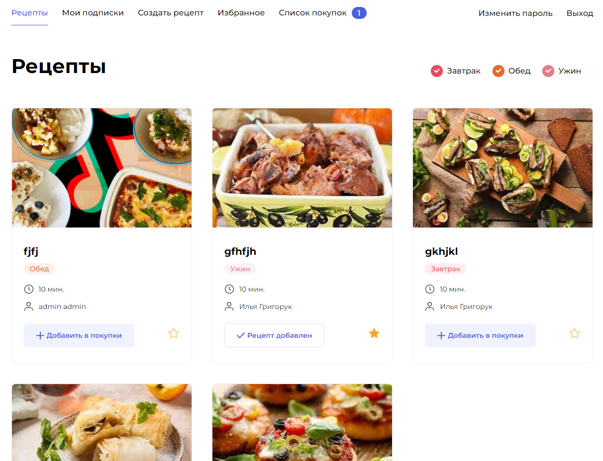

# Описание.

_Дипломный проект на учебном сервере от Яндекс._

## Технологии:
* Python 3.7
* Django 3.2
* PostgreSQL
* DRF
* Docker
* Nginx

Проект представляет из себя социальную сеть для обмена фотографиями любимых рецептов.
Проект состоит из бэкенд-приложения на Django и фронтенд-приложения на React.

При запуске проекта через Джанго-админку необходимо вручную добавить Тэги для рецептов.
Пример создания Тэгов:
<!-- 
 -->

Для дальнейшей работы, необходимо добавить список ингридиентов, которые будут использоваться в рецептах.
Список ингридиентов, уже подготовлен, он находится в папке - data/ingredients.csv
Добавление списка ингридиентов выполняется через Джанго-админку, кнопкой 'ИМПОРТ' во вкладке ингридиенты.
Процесс добавления ингридиентов:
<!-- 
 -->

Пример работы сайта:

Сайт имеет свой API-сервис, при работе с которым можно регистрировать пользователей, получать/создавать рецепты и многое другое.
Чтобы ознакомиться с полным списком возможных API запросов, необходимо: в папке infra, выполните команду: docker-compose up
После чего по адресу http://localhost/api/docs/ — будет доступна API спецификация. 

Проект доступен по ссылке: https://rissol-foodgram.ddns.net/

Автор: Григорук Илья - https://github.com/RiSSoL-86
